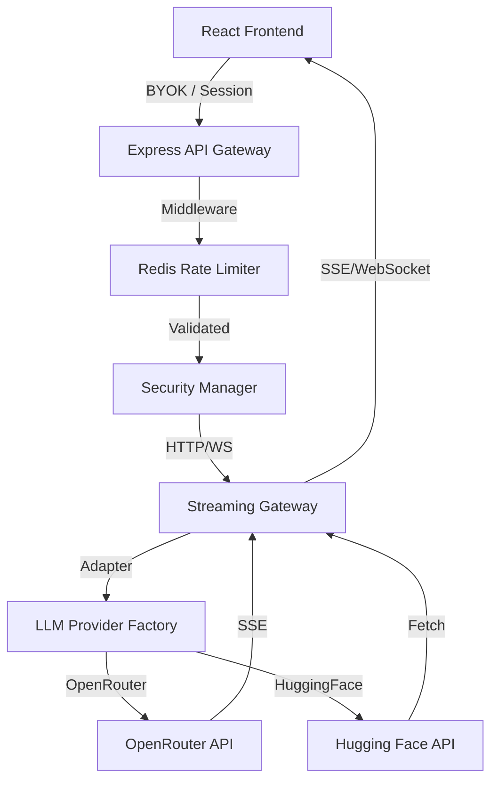

# 🧠 Model-Tester-Tool v1.5.0-Production

[](https://github.com/pdavim/Model-Tester-Tool/actions/workflows/ci.yml)

An elite, full-stack benchmarking platform designed to test, compare, and audit Large Language Models (LLMs) across multiple providers (OpenRouter, Hugging Face) with a focus on security, performance, and developer experience.

## 🚀 Key Features

- **⚔️ Model Battles**: Side-by-side comparison of different models with unified parameters.
- **🔌 Multi-Provider Support**: Seamlessly switch between OpenRouter and Hugging Face adapters.
- **📡 Resilient Streaming**: High-performance HTTP-SSE streaming with a **WebSocket Fallback Gateway** for restricted networks.
- **🛡️ Hardened Security**: Strict CSP policies (Helmet), Redis-backed distributed rate-limiting, and sanitized error logging (BYOK safe).
- **📊 Advanced Analytics**: Automated benchmark report generation (Markdown/JSON) and real-time response metrics.
- **📎 Multi-Modal Support**: Attachment processing for PDFs (with worker cleanup), images, and markdown.
- **🌓 Persistence & UX**: Persistent search history (IndexedDB), unified Dark Mode, and session Export/Import.

## 📡 Architecture & Data Flow



## 🛡️ Security Hardening

The Model-Tester-Tool follows industry-standard security practices:

- **JWT Authentication**: All endpoints require a valid Bearer token.
- **Unified Rate Limiting**: Distributed Redis-backed sliding window rate limits are enforced across HTTP and WebSocket protocols.
- **Strict CSP**: Helmet is configured to block unauthorized scripts and restrict image hosts.
- **Secret Redaction**: Server-side logs automatically redact sensitive patterns.
- **Audit Logging**: Every request is correlated with a unique Request ID.

### Authentication Config
Set `JWT_SECRET` in your `.env`. Tokens should be issued with appropriate scopes (e.g., `chat:write`).

### Image Whitelisting
Configure `ALLOWED_IMAGE_HOSTS` (comma-separated list) to restrict which external domains can be used for multi-modal inputs.

## 🚢 Production Deployment Hardening

### TLS Termination
Always run this tool behind a reverse proxy (Nginx/HAProxy) or an Ingress Controller that handles TLS termination.

### Helm / Kubernetes Hardening
Our Helm chart (`deploy/helm/`) enforces:
- `runAsNonRoot: true`
- `readOnlyRootFilesystem: true`
- Restrictive `NetworkPolicy` to allow only Redis and Provider API traffic.

### Resource Limits
Default production limits:
- CPU: `500m`
- Memory: `1Gi`

## 🏗️ Technical Architecture

### Technical Stack
- **Frontend**: React 19, Vite 6, Tailwind 4, Framer Motion.
- **State management**: Zustand 5 + Immer for immutable store updates.
- **Backend**: Node.js, Express 4, WebSocket (ws).
- **Infrastructure**: Redis (Rate Limiting/Cache), Prometheus (Metrics), Swagger (Docs).
- **Validation**: Zod for end-to-end schema safety.

## 🛠️ Quick Start

### Prerequisites
- **Node.js 20+**
- **Redis Server** (required for rate-limiting)

### 1. Installation
```bash
npm install
```

### 2. Configuration
Copy `env.example.txt` to `.env` and fill in your keys:
```bash
cp env.example.txt .env
```

### 3. Development
```bash
npm run dev
```

## 📜 API Documentation & Monitoring

- **Swagger UI**: Visit `http://localhost:3767/api/docs` for interactive API documentation.
- **Metrics**: Visit `http://localhost:3767/api/metrics` for Prometheus-formatted performance data.
- **Health Check**: `http://localhost:3767/api/health`

## 🚢 Production Deployment

### Docker
```bash
# Build multi-stage production image
bash docker build -t model-tester -f dockerfile.txt .

# Run with environment file
bash docker run -p 3767:3767 --env-file .env model-tester
```

### Kubernetes (Helm)
Deployment charts are located in the `helm/` directory.
```bash
helm install model-tester ./helm -f ./helm/values.yaml
```

## 🤝 Contributing
Refer to `strategy-23831d74-2.md` for the latest security audit and remediation roadmap.
